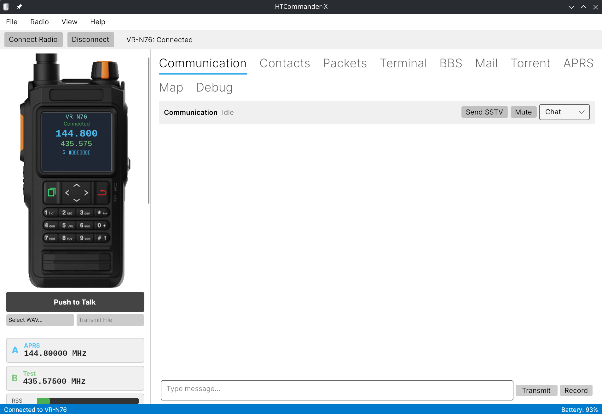

# HTCommander-X

> Cross-platform fork of [HTCommander](https://github.com/Ylianst/HTCommander)
> by Ylian Saint-Hilaire — adding Linux support and an Avalonia-based UI.



> **Note:** This software is still an early beta. Expect bugs and missing features. Use at your own risk — usage could potentially brick your radio. Use with caution.

### What's new in HTCommander-X

- **Cross-platform** — runs on Linux and Windows
- **Avalonia UI** replaces WinForms, with Light / Dark / Auto themes
- **Linux Bluetooth** via native RFCOMM sockets + BlueZ D-Bus discovery
- **Linux audio** via PortAudio output + parecord mic capture, espeak-ng TTS

### Download & Install

Download the latest release from the [Releases page](https://github.com/dikei100/HTCommander-X/releases/latest).

**Linux (AppImage)** — works on any distro, no installation needed:
```bash
chmod +x HTCommander-X-x86_64.AppImage
./HTCommander-X-x86_64.AppImage
```

**Debian / Ubuntu:**
```bash
sudo dpkg -i htcommander_*_amd64.deb
htcommander
```

**Fedora:**
```bash
sudo rpm -i htcommander-*.x86_64.rpm
htcommander
```

**Arch Linux:**
```bash
sudo pacman -U htcommander-*.pkg.tar.zst
htcommander
```

**Windows:**
Extract `HTCommander-X-win-x64.zip` and run `HTCommander.Desktop.exe`.

### External Software Integration (Windows)

HTCommander-X can interface with external ham radio software (fldigi, WSJT-X, VaraFM, Direwolf, etc.) for digital modes and other applications. On Linux, virtual serial ports and audio devices are created automatically. On Windows, third-party drivers are required:

**Rigctld (TCP) — no extra software needed**
Most ham software supports the rigctld TCP protocol for radio control. Enable it in Settings > Servers. This works out of the box on all platforms — no additional installation required.

**Virtual COM Ports — for software that requires serial CAT control (e.g. VaraFM)**

1. Install [com0com](https://com0com.sourceforge.net/) — a free, open-source virtual null-modem driver
2. Use the com0com setup utility to create a virtual COM port pair (e.g. COM10 ↔ COM11)
3. In HTCommander-X Settings > Servers, enable the CAT Server and select one port of the pair (e.g. COM10)
4. In your external software, configure the other port of the pair (e.g. COM11) as the CAT/radio port

**Virtual Audio Routing — for software that needs audio I/O with the radio**

Virtual audio devices allow external software to send and receive audio through the radio. This requires [VB-CABLE](https://vb-audio.com/Cable/) by VB-Audio:

1. Install **VB-CABLE A+B** (paid version) — two virtual audio cables are needed: one for RX audio (radio → external software) and one for TX audio (external software → radio)
2. Configure your external software to use the VB-CABLE devices as audio input/output
3. Configure HTCommander-X audio routing in Settings > Audio to use the corresponding VB-CABLE devices

Note: The free version of VB-CABLE only provides a single virtual cable, which is not sufficient for bidirectional audio routing. The A+B pack provides the two cables needed.

### AI Integration (MCP Server)

HTCommander-X includes a built-in [MCP](https://modelcontextprotocol.io/) (Model Context Protocol) server that allows AI assistants like [Claude Code](https://claude.com/claude-code) to control the radio and inspect application state programmatically. This enables scenarios like voice-controlled radio operation, automated monitoring, and AI-assisted debugging.

**Enabling the MCP server:**

1. Open Settings > Servers
2. Check **"Enable MCP Server (AI Control)"**
3. Set the port (default: 5678)
4. Optionally check **"Enable debug tools"** for full DataBroker inspection capabilities

**Connecting Claude Code:**

The project includes a `.mcp.json` file that configures Claude Code to connect automatically. When working in the HTCommander-X directory with Claude Code, the MCP tools become available after enabling the server. You can also add the server manually:

```bash
claude mcp add htcommander --url http://localhost:5678/
```

**Available MCP tools:**

| Category | Tools |
|----------|-------|
| Radio Queries | `get_connected_radios`, `get_radio_state`, `get_radio_info`, `get_radio_settings`, `get_channels`, `get_gps_position`, `get_battery` |
| Radio Control | `connect_radio`, `disconnect_radio`, `set_vfo_channel`, `set_volume`, `set_squelch`, `set_audio`, `set_gps`, `send_chat_message` |
| Debug (opt-in) | `get_logs`, `get_databroker_state`, `get_app_setting`, `set_app_setting`, `dispatch_event` |

**Claude Code Skills:**

Two built-in skills provide guided workflows:
- `/radio-status` — checks all connected radios and presents a summary
- `/debug-radio` — inspects logs, state, and connectivity to diagnose issues

**Testing with curl:**

```bash
# Initialize MCP session
curl -X POST http://localhost:5678/ \
  -H "Content-Type: application/json" \
  -d '{"jsonrpc":"2.0","id":1,"method":"initialize","params":{"protocolVersion":"2024-11-05","capabilities":{},"clientInfo":{"name":"test","version":"1.0"}}}'

# List available tools
curl -X POST http://localhost:5678/ \
  -H "Content-Type: application/json" \
  -d '{"jsonrpc":"2.0","id":2,"method":"tools/list","params":{}}'

# Get connected radios
curl -X POST http://localhost:5678/ \
  -H "Content-Type: application/json" \
  -d '{"jsonrpc":"2.0","id":3,"method":"tools/call","params":{"name":"get_connected_radios","arguments":{}}}'
```

For full implementation details and removal instructions, see [docs/MCP-Integration.md](docs/MCP-Integration.md).

### Acknowledgements

- **Ylian Saint-Hilaire** — original [HTCommander](https://github.com/Ylianst/HTCommander) author and maintainer
- **Kyle Husmann, KC3SLD** — [benlink](https://github.com/khusmann/benlink) Python library for GAIA protocol decoding, RFCOMM channel discovery, and audio codec reference
- **SarahRoseLives** — [flutter_benlink](https://github.com/SarahRoseLives/flutter_benlink) Flutter/Dart implementation, initialization sequence and VR-N76 quirks reference
- **Lee, K0QED** — [APRS-Parser](https://github.com/k0qed/aprs-parser)
- **OpenStreetMap** — [openstreetmap.org](https://openstreetmap.org), free geographic data for the world

### Disclaimer

This software is provided "as is", without warranty of any kind. The authors are not liable for any damage to equipment, software, or data resulting from the use of this software. Installation and use is entirely at your own risk.

---

## Information below is from the [original project](https://github.com/Ylianst/HTCommander):

### Radio Support

The following radios should work with this application:

- BTech UV-Pro
- BTech UV-50Pro (untested)
- RadioOddity GA-5WB (untested)
- Radtel RT-660 (Contact Developers)
- Vero VR-N75
- Vero VR-N76 (untested)
- Vero VR-N7500 (untested)
- Vero VR-N7600

### Features

Handi-Talky Commander is starting to have a lot of features.

- [Bluetooth Audio](https://github.com/Ylianst/HTCommander/blob/main/docs/Bluetooth.md). Uses audio connectivity to listen and transmit with your computer speakers, microphone or headset.
- [Speech-to-Text](https://github.com/Ylianst/HTCommander/blob/main/docs/Voice.md). Open AI Whisper integration will convert audio to text, a Windows Speech API will convert text to speech.
- [Channel Programming](https://github.com/Ylianst/HTCommander/blob/main/docs/Channels.md). Configure, import, export and drag & drop channels to create the perfect configuration for your usages.
- [APRS support](https://github.com/Ylianst/HTCommander/blob/main/docs/APRS.md). You can receive and sent APRS messages, set APRS routes, send [SMS message](https://github.com/Ylianst/HTCommander/blob/main/docs/APRS-SMS.md) to normal phones, request [weather reports](https://github.com/Ylianst/HTCommander/blob/main/docs/APRS-Weather.md), send [authenticated messages](https://github.com/Ylianst/HTCommander/blob/main/docs/APRS-Auth.md), get details on each APRS message.
- [BSS support](https://github.com/Ylianst/HTCommander/blob/main/docs/BSS-Protocol.md). Support for the propriatary short message binary protocol from Baofeng / BTech.
- [APRS map](https://github.com/Ylianst/HTCommander/blob/main/docs/Map.md). With Open Street Map support, you can see all the APRS stations at a glance.
- [Winlink mail support](https://github.com/Ylianst/HTCommander/blob/main/docs/Mail.md). Send and receive email on the [Winlink network](https://winlink.org/), this includes support to attachments.
- [SSTV](https://github.com/Ylianst/HTCommander/blob/main/docs/SSTV.md) send and receive images. Reception is auto-detected, drag & drop to sent.
- [Torrent file exchange](https://github.com/Ylianst/HTCommander/blob/main/docs/Torrent.md). Many-to-many file exchange with a torrent file transfer system over 1200 Baud FM-AFSK.
- [Address book](https://github.com/Ylianst/HTCommander/blob/main/docs/AddressBook.md). Store your APRS contacts and Terminal profiles in the address book to quick access.
- [Terminal support](https://github.com/Ylianst/HTCommander/blob/main/docs/Terminal.md). Use the terminal to communicate in packet modes with other stations, users or BBS'es.
- [BBS support](https://github.com/Ylianst/HTCommander/blob/main/docs/BBS.md). Built-in support for a BBS. Right now it's basic with WInLink and a text adventure game. Route emails and challenge your friends to get a high score over packet radio.
- [Packet Capture](https://github.com/Ylianst/HTCommander/blob/main/docs/Capture.md). Use this application to capture and decode packets with the built-in packet capture feature.
- [GPS Support](https://github.com/Ylianst/HTCommander/blob/main/docs/GPS.md). Support for the radio's built in GPS if you have radio firmware that supports it.
- [Audio Clips](https://github.com/Ylianst/HTCommander/blob/main/docs/Voice-Clips.md) record and playback short voice clips on demand.
- [AGWPE Protocol](https://github.com/Ylianst/HTCommander/blob/main/docs/Agwpe.md). Supports routing other application's traffic over the radio using the AGWPE protocol.
- [APSK 1200 Software modem](https://github.com/Ylianst/HTCommander/blob/main/docs/SoftModem.md) with ECC/CRC error correction support.

### Demonstration Video

[](https://www.youtube.com/watch?v=JJ6E7fRQD7o)

### Credits

This tool is based on the decoding work done by Kyle Husmann, KC3SLD and this [BenLink](https://github.com/khusmann/benlink) project which decoded the Bluetooth commands for these radios. Also [APRS-Parser](https://github.com/k0qed/aprs-parser) by Lee, K0QED.

Map data provided by [openstreetmap.org](https://openstreetmap.org), the project that creates and distributes free geographic data for the world.
